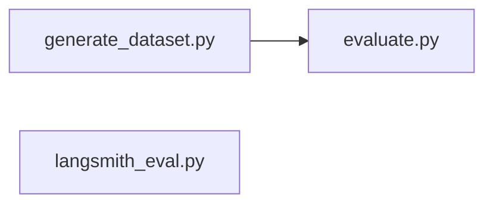

# `rag_python` workflow docs

| Doc | Script | One-line purpose |
|-----|--------|------------------|
| [generate_dataset_workflow.md](./generate_dataset_workflow.md) | `generate_dataset.py` | Build synthetic Q/A eval set from PDF (RAGAS + Gemini) |
| [evaluate_workflow.md](./evaluate_workflow.md) | `evaluate.py` | Compare chunk configs with RAGAS metrics |
| [langsmith_eval_workflow.md](./langsmith_eval_workflow.md) | `langsmith_eval.py` | LangSmith LLM-as-judge eval on web docs |

