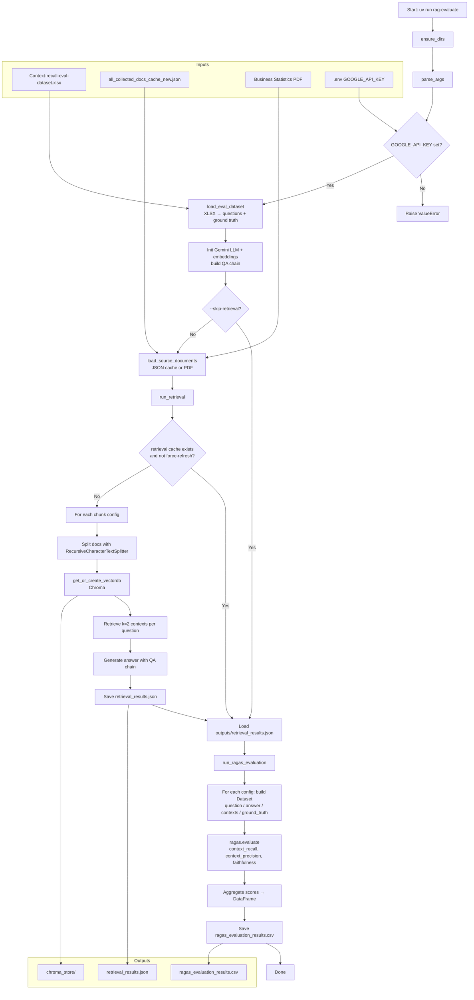
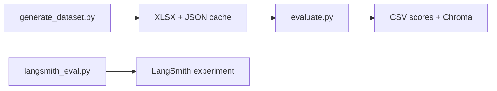

# Workflow: `evaluate.py`

This script **evaluates RAG chunking strategies** with **RAGAS metrics** and **Google Gemini**. It is the second step in the `rag_python` pipeline and consumes outputs from `generate_dataset.py`.

## Purpose

For each chunking config (`chunk_size` × `chunk_overlap`), the script:

1. Loads the eval questions + ground-truth answers
2. Loads source documents (JSON cache, or PDF fallback)
3. Re-chunks documents and builds/loads a Chroma vector store
4. Retrieves top-k context for each question and generates an answer with Gemini
5. Scores each config with RAGAS (`context_recall`, `context_precision`, `faithfulness`)
6. Writes aggregate scores to CSV

## How to run

```bash
cd rag_python
uv run rag-evaluate
```

Useful options:

| Flag | Default | Meaning |
|------|---------|---------|
| `--dataset` | `data/Context-recall-eval-dataset.xlsx` | Q/A eval set from `generate_dataset.py` |
| `--docs-cache` | `data/all_collected_docs_cache_new.json` | Cached source chunks/pages |
| `--pdf` | `data/Business Statistics ....pdf` | Fallback if cache is missing |
| `--retrieval-cache` | `outputs/retrieval_results.json` | Cached Q/A + contexts per config |
| `--results-csv` | `outputs/ragas_evaluation_results.csv` | Final metric table |
| `--chroma-root` | `outputs/chroma_store` | Persisted vector indexes |
| `--force-refresh-retrieval` | off | Rebuild retrieval answers even if cache exists |
| `--skip-retrieval` | off | Score only from an existing retrieval cache |

Required env var: `GOOGLE_API_KEY` (in `rag_python/.env`).

## Models used

| Role | Model constant | Used for |
|------|----------------|----------|
| Chat LLM | `CHAT_MODEL` | Answer generation + RAGAS judge |
| Embeddings | `EMBEDDING_MODEL` | Chroma indexing / similarity search |

## Chunking configs under test

```text
CHUNK_SIZES    = [1000, 1200]
CHUNK_OVERLAPS = [200, 250]
```

That produces four configs:

| Config name | chunk_size | chunk_overlap |
|-------------|------------|---------------|
| `Recursive_1000_200` | 1000 | 200 |
| `Recursive_1000_250` | 1000 | 250 |
| `Recursive_1200_200` | 1200 | 200 |
| `Recursive_1200_250` | 1200 | 250 |

Each config gets its own Chroma directory under `outputs/chroma_store/<config_name>/`.

## End-to-end flow



## Step-by-step breakdown

### 1. Bootstrap

- Creates `data/` and `outputs/` if needed
- Loads API key from `.env`
- Applies the Vertex AI import shim before RAGAS imports

### 2. Load evaluation dataset

`load_eval_dataset()` reads the Excel file and requires:

- `user_input` → question list
- `reference` → ground-truth lookup keyed by question

If the file is missing, it tells you to run `uv run rag-generate-dataset` first.

### 3. Load source documents

`load_source_documents()` prefers the JSON cache. If absent, it loads PDF pages `[48:100]` and writes a new cache.

### 4. Build the QA chain

```text
ChatPromptTemplate → Gemini LLM → StrOutputParser
```

Prompt pattern: system instruction + `{context}` + `{question}`.

### 5. Retrieval + generation sweep (`run_retrieval`)

For each chunking config:

1. Re-split source docs with that size/overlap
2. Create or load Chroma at `outputs/chroma_store/<config>/`
3. Retrieve top **2** chunks per question
4. Ask Gemini to answer from the combined context
5. Store `{question, answer, contexts}` per question

Results are cached to `outputs/retrieval_results.json` so you can re-score without re-calling the LLM:

```bash
uv run rag-evaluate --skip-retrieval
```

To rebuild answers:

```bash
uv run rag-evaluate --force-refresh-retrieval
```

### 6. RAGAS scoring (`run_ragas_evaluation`)

For each config, builds a HuggingFace `Dataset` with:

| Field | Source |
|-------|--------|
| `question` | retrieval result |
| `answer` | generated answer |
| `contexts` | retrieved chunk texts |
| `ground_truth` | Excel `reference` |

Then runs:

- **context_recall** — did retrieved context cover the ground truth?
- **context_precision** — are retrieved chunks relevant/useful?
- **faithfulness** — is the answer grounded in retrieved context (less hallucination)?

### 7. Export scores

Aggregate metrics are written to:

`outputs/ragas_evaluation_results.csv`

Example shape:

| config | context_recall | context_precision | faithfulness |
|--------|----------------|-------------------|--------------|
| Recursive_1000_200 | 0.62 | 1.00 | 0.68 |
| Recursive_1000_250 | ... | ... | ... |

## Where this fits in the larger pipeline



| Script | Role |
|--------|------|
| `generate_dataset.py` | Create Q/A eval set from PDF |
| `evaluate.py` | Compare chunk configs with RAGAS |
| `langsmith_eval.py` | Separate web-doc RAG eval in LangSmith |

## Inputs and outputs map

```text
rag_python/
├── .env
├── data/
│   ├── Context-recall-eval-dataset.xlsx      # INPUT
│   ├── all_collected_docs_cache_new.json     # INPUT (preferred)
│   └── Business Statistics ....pdf           # INPUT (fallback)
├── outputs/
│   ├── retrieval_results.json                # OUTPUT / cache
│   ├── ragas_evaluation_results.csv          # OUTPUT
│   └── chroma_store/                         # OUTPUT
│       ├── Recursive_1000_200/
│       ├── Recursive_1000_250/
│       ├── Recursive_1200_200/
│       └── Recursive_1200_250/
└── rag_eval/
    └── evaluate.py
```

## Metrics mental model

| Metric | Asks |
|--------|------|
| `context_recall` | Did we retrieve enough of the right information? |
| `context_precision` | Was retrieved context mostly relevant? |
| `faithfulness` | Did the model stick to retrieved facts? |

## Failure points to watch

| Situation | What happens |
|-----------|----------------|
| Missing `GOOGLE_API_KEY` | `ValueError` |
| Missing eval Excel | `FileNotFoundError` (run generate first) |
| Missing cache and PDF | `FileNotFoundError` |
| `--skip-retrieval` without cache | `FileNotFoundError` |
| Per-question retrieval/LLM error | That row is stored with `"Error in retrieval"` and empty contexts |
| Index build failure for a config | That config gets an empty result list |

## Minimal mental model

> **Eval questions + docs → try 4 chunk configs → retrieve & answer → RAGAS scores → CSV**
