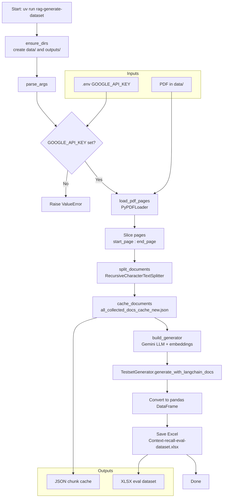
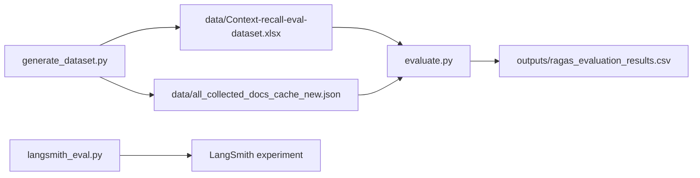

# Workflow: `generate_dataset.py`

This script builds a **synthetic RAG evaluation dataset** from a PDF using **RAGAS** and **Google Gemini**. It is the first step in the `rag_python` pipeline and feeds `evaluate.py`.

## Purpose

Given a source PDF, the script:

1. Loads a page range
2. Splits pages into overlapping chunks
3. Caches those chunks as JSON (reused later by evaluation)
4. Asks RAGAS + Gemini to invent question/answer pairs grounded in the chunks
5. Saves the resulting dataset as an Excel file

## How to run

```bash
cd rag_python
uv run rag-generate-dataset
```

Useful options:

| Flag | Default | Meaning |
|------|---------|---------|
| `--pdf` | `data/Business Statistics - A. Aczel, J. Sounderpandian.pdf` | Source PDF |
| `--start-page` | `48` | Inclusive page index |
| `--end-page` | `100` | Exclusive page index |
| `--chunk-size` | `800` | Chunk character size |
| `--chunk-overlap` | `100` | Overlap between chunks |
| `--testset-size` | `5` | Number of synthetic examples to generate |
| `--docs-cache` | `data/all_collected_docs_cache_new.json` | Chunk cache output |
| `--output-xlsx` | `data/Context-recall-eval-dataset.xlsx` | Dataset output |
| `--debug` | off | Extra RAGAS debug logs |

Required env var: `GOOGLE_API_KEY` (in `rag_python/.env`).

## Models used

| Role | Model constant | Used for |
|------|----------------|----------|
| Chat LLM | `CHAT_MODEL` | Question / answer / reference synthesis inside RAGAS |
| Embeddings | `EMBEDDING_MODEL` | Chunk similarity / knowledge-graph style transforms inside RAGAS |

Both are wrapped with RAGAS adapters:

- `LangchainLLMWrapper(ChatGoogleGenerativeAI(...))`
- `LangchainEmbeddingsWrapper(GoogleGenerativeAIEmbeddings(...))`

## End-to-end flow



## Step-by-step breakdown

### 1. Bootstrap

- `ensure_dirs()` creates `rag_python/data` and `rag_python/outputs` if missing.
- `paths.py` loads `.env` from `rag_python/.env`, then falls back to the repo-root `.env`.
- `ensure_vertexai_shim()` runs before RAGAS imports so newer `langchain-community` versions do not crash on a missing Vertex AI symbol.

### 2. Load PDF pages

`load_pdf_pages()`:

1. Checks the PDF path exists
2. Loads all pages with `PyPDFLoader`
3. Keeps only `pages[start_page:end_page]`

Default slice `[48:100]` focuses generation on a mid-book section instead of the full PDF (faster / cheaper).

### 3. Chunk documents

`split_documents()` uses `RecursiveCharacterTextSplitter` with:

- `chunk_size=800`
- `chunk_overlap=100`

Overlap helps preserve context across chunk boundaries so synthetic questions can still be answered from nearby text.

### 4. Cache chunks

`cache_documents()` writes:

```json
[
  {"page_content": "...", "metadata": {...}},
  ...
]
```

to `data/all_collected_docs_cache_new.json`.

This cache is later reused by `evaluate.py` so evaluation does not need to re-parse the PDF from scratch.

### 5. Build RAGAS generator

`build_generator()` creates a `TestsetGenerator` with Gemini chat + embedding models.

Internally, RAGAS typically:

1. Builds a knowledge representation over chunks (summaries / relationships)
2. Synthesizes queries (single-hop / multi-hop styles)
3. Produces a reference answer for each query from the source context

### 6. Generate dataset

```python
dataset = generator.generate_with_langchain_docs(
    docs_for_ragas,
    testset_size=args.testset_size,
    with_debugging_logs=args.debug,
)
```

`testset_size` controls how many examples RAGAS aims to produce (actual count can vary slightly by synthesizer mix).

### 7. Export Excel

The dataset is converted to a pandas DataFrame and saved as:

`data/Context-recall-eval-dataset.xlsx`

Common columns (from RAGAS):

| Column | Meaning |
|--------|---------|
| `user_input` | Generated question |
| `reference` | Ground-truth / reference answer |
| `reference_contexts` | Source chunk(s) used to create the example |
| `persona_name` / `query_style` / `synthesizer_name` | Metadata about how the sample was synthesized |

`evaluate.py` mainly needs **`user_input`** and **`reference`**.

## Where this fits in the larger pipeline



| Script | Role |
|--------|------|
| `generate_dataset.py` | Create Q/A eval set from PDF |
| `evaluate.py` | Retrieve + answer + score with RAGAS metrics |
| `langsmith_eval.py` | Separate web-doc RAG eval in LangSmith |

## Inputs and outputs map

```text
rag_python/
├── .env                                      # GOOGLE_API_KEY
├── data/
│   ├── Business Statistics ....pdf           # INPUT
│   ├── all_collected_docs_cache_new.json     # OUTPUT (chunk cache)
│   └── Context-recall-eval-dataset.xlsx      # OUTPUT (eval dataset)
└── rag_eval/
    └── generate_dataset.py
```

## Failure points to watch

| Situation | What happens |
|-----------|----------------|
| Missing `GOOGLE_API_KEY` | Script exits with a clear `ValueError` |
| PDF path wrong | `FileNotFoundError` |
| Gemini / RAGAS API errors | Raised during `generate_with_langchain_docs` |
| Very large page range / testset | Slower runtime and higher API cost |

## Minimal mental model

> **PDF pages → chunks → cache JSON → RAGAS+Gemini invent Q&A → Excel dataset for evaluation**
