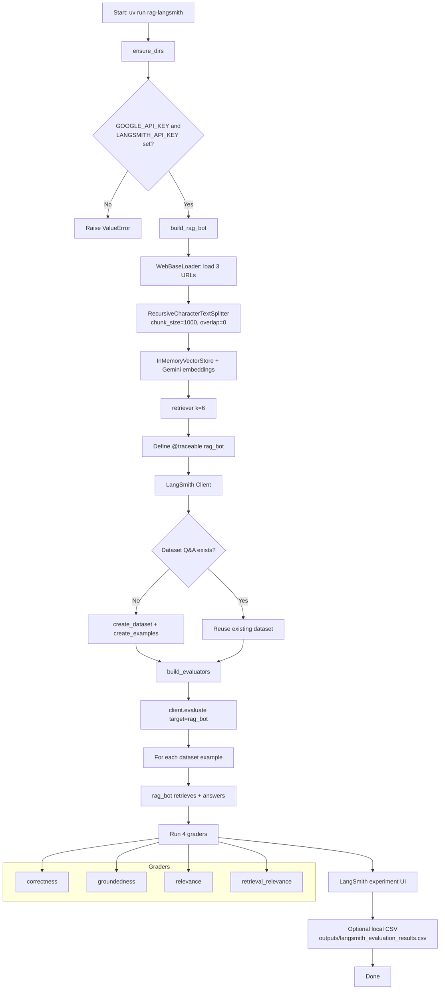
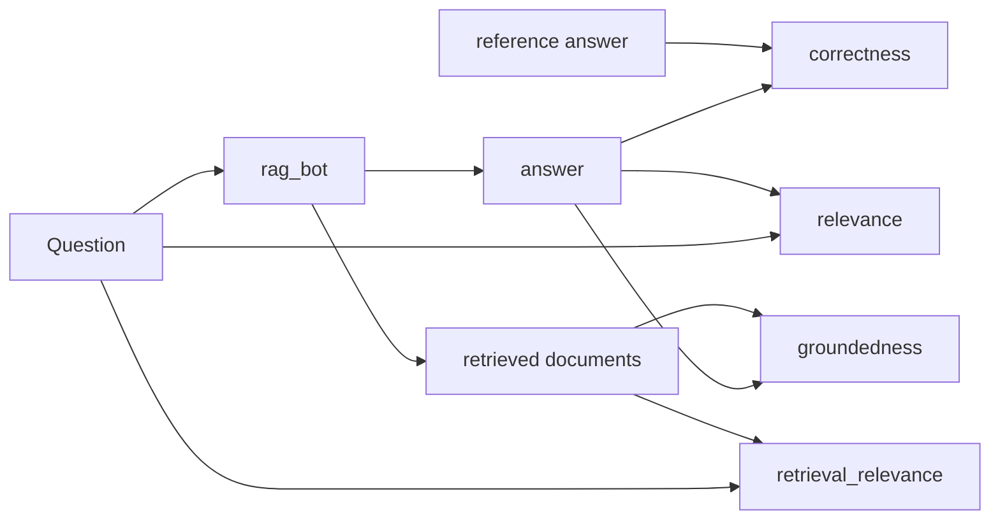
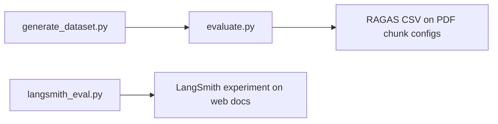

# Workflow: `langsmith_eval.py`

This script runs a **LangSmith-hosted RAG evaluation** over Lilian Weng blog posts using **Google Gemini**. It is a **separate path** from the PDF + RAGAS pipeline (`generate_dataset.py` → `evaluate.py`).

## Purpose

The script:

1. Loads three public blog posts from the web
2. Chunks them and builds an **in-memory** vector store
3. Creates a traced RAG bot (`@traceable`)
4. Ensures a LangSmith dataset (`Q&A`) with fixed ground-truth examples exists
5. Runs `client.evaluate(...)` with four LLM-as-judge evaluators
6. Prints results and optionally saves a local CSV copy

## How to run

```bash
cd rag_python
uv run rag-langsmith
```

Required env vars (in `rag_python/.env`):

| Variable | Used for |
|----------|----------|
| `GOOGLE_API_KEY` | Gemini chat + embeddings |
| `LANGSMITH_API_KEY` | Dataset storage, tracing, experiment UI |

Also sets `LANGSMITH_TRACING=true` so LangChain / retriever / LLM calls show up in LangSmith.

## Models used

| Role | Model constant | Used for |
|------|----------------|----------|
| Chat LLM | `CHAT_MODEL` | RAG answers + structured graders |
| Embeddings | `EMBEDDING_MODEL` | In-memory vector index |

## Data sources

Hard-coded URLs:

1. https://lilianweng.github.io/posts/2023-06-23-agent/
2. https://lilianweng.github.io/posts/2023-03-15-prompt-engineering/
3. https://lilianweng.github.io/posts/2023-10-25-adv-attack-llm/

Hard-coded LangSmith examples cover:

- ReAct / self-reflection
- Few-shot prompting biases
- Types of adversarial attacks

Eval Q/A pairs live in `data/langsmith_qa_examples.json` (13+ examples spanning agents, prompting, and adversarial attacks). The script loads that file at startup and syncs any missing examples into the LangSmith `Q&A` dataset.
## End-to-end flow



## Step-by-step breakdown

### 1. Bootstrap

- Ensures `outputs/` exists
- Validates both API keys
- Enables LangSmith tracing

### 2. Build the RAG bot (`build_rag_bot`)

1. Load web pages with `WebBaseLoader`
2. Split with `RecursiveCharacterTextSplitter(chunk_size=1000, chunk_overlap=0)`
3. Embed into `InMemoryVectorStore` (not persisted to disk)
4. Expose a retriever with `k=6`
5. Wrap answering logic in `@traceable()` so each call is a LangSmith run

`rag_bot(question)` returns:

```python
{"answer": "<model text>", "documents": [<retrieved Document>, ...]}
```

Answer prompt rules: use source docs, admit unknowns, max three sentences.

### 3. Ensure LangSmith dataset (`ensure_dataset`)

Dataset name: **`Q&A`**

- If missing → create dataset and upload the three fixed examples
- If present → reuse it (examples are not re-uploaded)

Each example has:

- `inputs.question`
- `outputs.answer` (reference / ground truth)

### 4. Build evaluators (`build_evaluators`)

Each grader is Gemini with **structured output** (`TypedDict` schema: explanation + boolean score).

| Evaluator | Needs reference answer? | Uses retrieved docs? | What it checks |
|-----------|-------------------------|----------------------|----------------|
| `correctness` | Yes | No | Factual match vs ground truth |
| `relevance` | No | No | Answer addresses the question |
| `groundedness` | No | Yes | Answer stays inside retrieved facts |
| `retrieval_relevance` | No | Yes | Retrieved docs relate to the question |

### 5. Run the experiment

```python
client.evaluate(
    target,                          # wraps rag_bot(inputs["question"])
    data="Q&A",
    evaluators=[...],
    experiment_prefix="rag-doc-relevance-gemini",
    metadata={...},
)
```

LangSmith will:

1. Iterate dataset examples
2. Call `target` to produce answer + documents
3. Call each evaluator
4. Store traces / feedback in an experiment you can open in the LangSmith UI

### 6. Local export

If pandas conversion works, results are also written to:

`outputs/langsmith_evaluation_results.csv`

## Evaluator detail flow



## Where this fits in the larger pipeline



These are **parallel evaluation tracks**:

| Track | Corpus | Dataset source | Scoring | Persistence |
|-------|--------|----------------|---------|-------------|
| PDF / RAGAS | Business Statistics PDF | Generated Excel | RAGAS metrics | Local Chroma + CSV |
| LangSmith | Lilian Weng blogs | Hard-coded examples in LangSmith | LLM-as-judge booleans | LangSmith cloud + optional CSV |

## Inputs and outputs map

```text
rag_python/
├── .env                                      # GOOGLE_API_KEY + LANGSMITH_API_KEY
├── data/
│   └── langsmith_qa_examples.json            # INPUT (Q/A examples + source URLs)
├── outputs/
│   └── langsmith_evaluation_results.csv      # OUTPUT (local copy)
└── rag_eval/
    └── langsmith_eval.py

LangSmith cloud:
├── Dataset: Q&A
└── Experiment: rag-doc-relevance-gemini-*
```

## Failure points to watch

| Situation | What happens |
|-----------|----------------|
| Missing `GOOGLE_API_KEY` / `LANGSMITH_API_KEY` | `ValueError` |
| Web pages unreachable | Loader / RAG build fails |
| Dataset already exists with different examples | Script reuses dataset as-is (does not overwrite) |
| Structured-output grader parse issues | Evaluator call can fail for that example |
| pandas conversion fails | Experiment still succeeded in LangSmith; local CSV skipped |

## Minimal mental model

> **Web posts → in-memory RAG bot → LangSmith dataset examples → 4 Gemini judges → experiment results**
